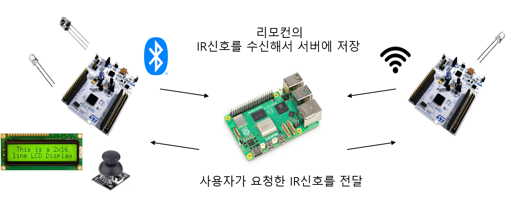
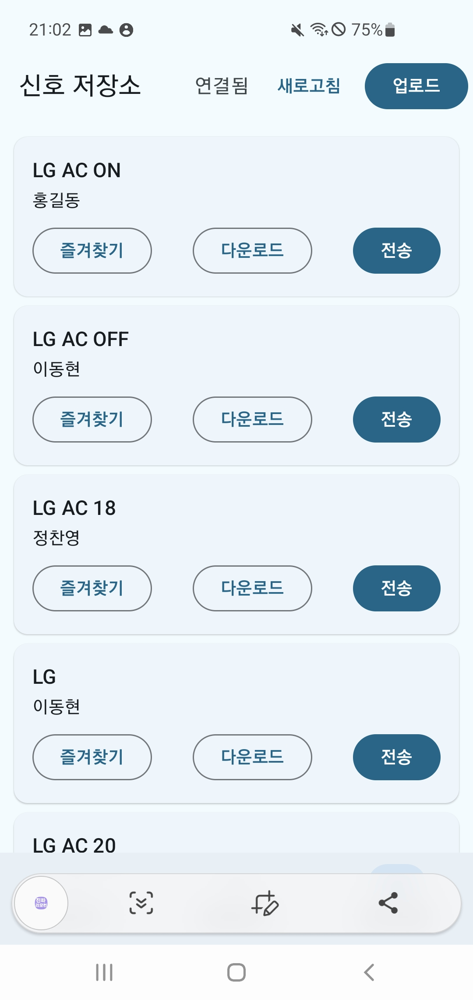
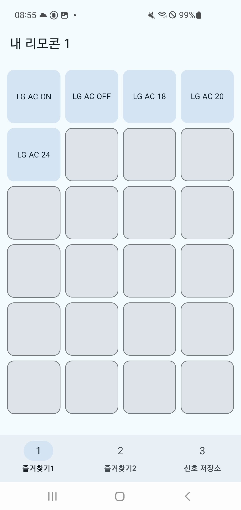
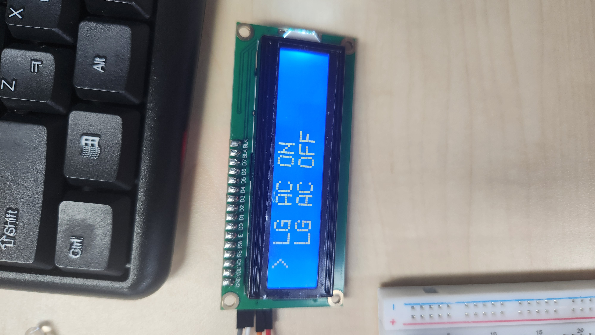

# 📱 진짜 리모컨 (Real Remote)
제조사 및 기종 제한을 허문 사용자 맞춤형 IR 통합 제어 솔루션

가전제품마다 다른 리모컨을 사용해야 하는 번거로움과 외부 제어의 불가능함을 해결하기 위해 기획되었습니다. STM32, WiFi/BLE, FastAPI, Android를 사용해 어디서든 가전을 제어할 수 있는 시스템을 구축했습니다. 

---

## 🏗️ 시스템 구성 (System Architecture)

사용자가 앱을 통해 특정 가전의 IR 신호를 요청하면, 서버(FastAPI)를 거쳐 STM32 보드가 Wi-Fi/Bluetooth로 명령을 수신하고 IR 신호를 방출합니다. 

  

### 🛠️ 기술 스택 (Tech Stack)
* **Embedded**: STM32 Nucleo Board (GPIO, Timer, Wi-Fi/BT 제어) 
* **Backend**: Python FastAPI, SQLAlchemy, SQL DB 
* **App**: Android (Kotlin/Java), 전용 커스터마이징 UI 
* **Sensors**: IR Receiver/Emitter, 16x2 LCD, Joystick 

---

## ✨ 핵심 기능 (Key Features)

### 1. 전용 모바일 앱 및 실시간 DB 연동
* **신호 저장소**: DB에 등록된 다양한 제조사의 IR 신호를 실시간으로 확인하고 선택할 수 있습니다. 
* **즐겨찾기**: 자주 사용하는 가전 기능을 메인 화면에 배치하여 즉시 제어가 가능합니다. 

   
  

### 2. IR 신호 학습 및 실행 (Save & Use Mode)
* **Save Mode**: 수신 모듈을 통해 기존 리모컨 신호를 읽어 들여 서버 DB에 새롭게 등록합니다. 
* **Use Mode**: 저장된 신호를 호출하여 실제 가전제품(에어컨, TV 등)으로 출력합니다. 

  
  

### 3. 차별화된 범용성
* 특정 제조사 제품만 지원하는 시중의 저가형 통합 리모컨과 달리, 신호 학습 기능을 통해 이론상 모든 IR 제어 가전에 대응이 가능합니다. 

---

## 📺 시연 영상 (Demo)

| LCD UI 구현 (LCD) | 가전제품 실제 제어 시연 |
| :---: | :---: |
| <video src="images/lcd기본화면.mov" width="350" controls muted autoplay loop></video> | <video src="images/에어컨-시연영상.mov" width="265" controls muted autoplay loop></video> |
| **Save Mode 진입 및 통신 확인**  | **에어컨/가전 실제 작동 확인**  |

---

## 📈 프로젝트 회고 

* **하드웨어 최적화**: IR 신호의 도달 거리 문제를 해결하기 위해 저항값 최적화 및 MOSFET 회로를 설계하여 출력 세기를 안정적으로 확보했습니다. 
* **향후 계획**: 수신 감도가 더 높은 모듈로 개선하고, 케이스 설계를 통해 실제 상용화 가능한 수준의 완제품 제작을 목표로 하고 있습니다. 

---

## 👨‍💻 기여한 부분
* **개발 환경**: STM32CubeIDE, VS Code, Android Studio
* **담당 역할**: 하드웨어 펌웨어 제어, 백엔드 API 및 DB 설계, 앱-서버 통신 로직 구현

